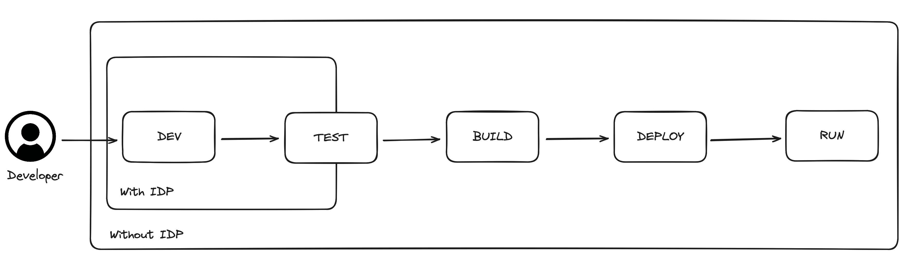

# Internal Developer Platform

## What is an Internal Developer Platform?

An Internal Developer Platform (IDP) is a platform that allows developers to create, manage and deploy their applications. It is a set of practices and tools that allow developers to build, test, and deploy their applications in a consistent and reliable way. It is a comprehensive toolset that streamlines and automates the software development lifecycle, aiming to boost efficiency, standardize processes, and reduce complexity for developers. By providing a unified framework for development, operations, and security tasks, IDPs enable teams to focus more on coding and less on the overhead associated with deploying and managing applications. Here’s a detailed look into what an IDP is, its key components, benefits, and best practices for implementation.

## Definition

An IDP is a self-service platform that abstracts complex cloud environments and operational tasks into a simpler, developer-friendly interface. It integrates various tools and technologies used in software development, deployment, monitoring, and maintenance into a cohesive ecosystem that developers can interact with through a unified dashboard or command-line interface.

## Key Components

1. **Source Control Management (SCM)**: Integrates with SCM systems like Git to automate the flow of code from version control to production.
2. **Continuous Integration and Continuous Deployment (CI/CD)**: Automates the build, test, and deployment pipelines, ensuring that new code changes are automatically built, tested, and deployed.
3. **Infrastructure as Code (IaC)**: Manages and provisions cloud resources using code, enabling repeatable and consistent environment setups.
4. **Monitoring and Logging**: Centralizes logging, monitoring, and alerting tools to provide insights into application performance and troubleshoot issues.
5. **Security and Compliance**: Embeds security practices into the development lifecycle, from automated code scanning to runtime security policies.
6. **Collaboration and Documentation**: Facilitates team collaboration and knowledge sharing with integrated documentation tools and communication platforms.

## Benefits

- Increased Developer Productivity: By automating repetitive tasks and standardizing development workflows, developers can focus on writing code rather than managing infrastructure.
- Enhanced Collaboration: Teams can work more efficiently together with integrated tools for communication, documentation, and version control.
- Improved Quality and Reliability: Automated testing and deployment processes ensure that code changes are validated and applied consistently, reducing the risk of errors.
- Faster Time to Market: Streamlined workflows and reduced manual intervention lead to quicker release cycles, allowing organizations to respond faster to market demands.
- Scalability and Flexibility: IDPs support scalable cloud-native technologies and can adapt to changing business requirements and technology landscapes.

## Best Practices for Implementation

1. Assess Your Needs: Understand the specific challenges and requirements of your development teams to choose the right tools and features for your IDP.
2. Start Small and Expand Gradually: Begin with a core set of features and gradually add more tools and capabilities based on feedback and evolving needs.
3. Ensure Scalability and Flexibility: Choose technologies and architectures that can grow with your organization and accommodate new tools and practices.
4. Foster a Culture of Collaboration: Encourage teams to share knowledge and collaborate closely, leveraging the IDP to bridge gaps between development, operations, and security.
5. Prioritize Security and Compliance: Embed security practices into the development process and ensure that your IDP supports compliance with relevant regulations and standards.

## Conclusion

An Internal Developer Platform is a powerful enabler for modern software development practices, providing a unified environment for development, deployment, and operations tasks. By automating and streamlining the software development lifecycle, IDPs help organizations achieve faster time to market, improved quality, and increased developer productivity. As organizations continue to adopt cloud-native technologies and modern development practices, IDPs will play a crucial role in driving efficiency, collaboration, and innovation across development teams.

## References

- [Internal Developer Platform](https://internaldeveloperplatform.org/)
- [Don't Call It A Platform](https://samnewman.io/blog/2023/02/08/dont-call-it-a-platform/)