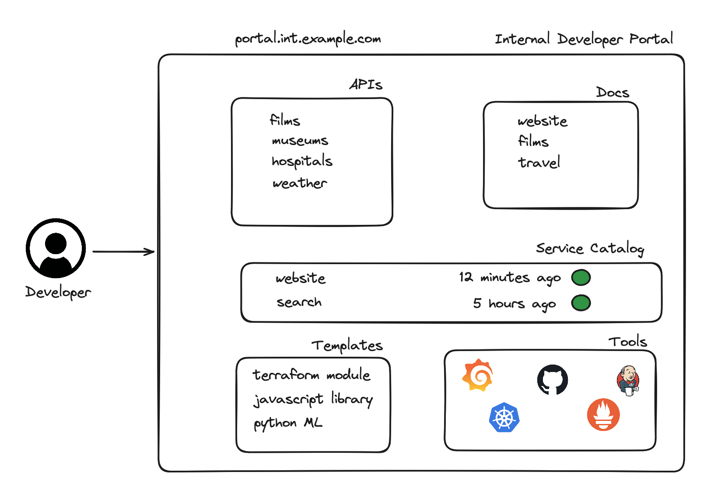

# Internal Developer Portal

## What is an Internal Developer Portal?

An Internal Developer Portal serves as a centralized hub for an organization's software development resources, tools, and documentation. It is designed to improve the developer experience by providing easy access to everything developers need to efficiently build, deploy, and maintain their applications. Below, we delve into the purpose, key features, benefits, and best practices for setting up and managing an effective Internal Developer Portal.

## Purpose

The primary aim of an Internal Developer Portal is to streamline the software development process within an organization by acting as a single point of access for development resources, including APIs, services, tools, best practices, and guidelines. It facilitates knowledge sharing, promotes standardization, and enhances collaboration across development teams.

## Key Features

1. Comprehensive Documentation: Includes detailed documentation for internal APIs, libraries, and frameworks, along with getting-started guides, tutorials, and API references.
2. API Catalog: A searchable catalog of all internal and external APIs available to developers, including endpoints, authentication methods, and usage policies.
3. Tool Access: Provides links or integrations with internal tools for continuous integration and deployment (CI/CD), monitoring, logging, and project management.
4. Environment Management: Enables developers to provision, manage, and access development, testing, and production environments.
5. Support and Collaboration Features: Offers forums, chat channels, or ticketing systems for developers to seek help, collaborate on projects, and share knowledge.
6. Access Control: Implements role-based access control to ensure that developers have appropriate access to resources, based on their roles and projects.

## Benefits

- Improved Developer Productivity: By providing easy access to resources and documentation, developers can quickly find what they need, reducing the time spent on searching for information or reinventing the wheel.
- Enhanced Collaboration: Facilitates better communication and knowledge sharing among developers, helping to break down silos between teams.
- Standardization and Best Practices: Promotes consistency in development practices and use of technologies across the organization, leading to more maintainable and scalable applications.
- Faster Onboarding: New developers can get up to speed more quickly by accessing comprehensive guides and resources in one place.
- Increased Innovation: By reducing administrative overhead and streamlining access to tools and services, developers can focus more on innovation and building new features.

## Best Practices for Implementation

1. User-Centric Design: Design the portal with the end-user in mind. Ensure it is intuitive, easy to navigate, and provides quick access to the most needed resources.
2. Keep Content Up-to-Date: Regularly update documentation, guides, and resources to reflect the latest changes in tools, APIs, and best practices.
3. Foster a Collaborative Culture: Encourage contributions from all developers to the portal, whether in the form of documentation, tutorials, or tool recommendations.
4. Integrate with Existing Workflows: Seamlessly integrate the portal with existing tools and workflows to avoid disrupting the development process.
5. Gather Feedback and Iterate: Continuously collect feedback from users and make improvements to the portal based on this feedback to ensure it remains relevant and useful.

## Conclusion

An Internal Developer Portal is a vital component in fostering a productive, collaborative, and efficient software development environment. By centralizing access to tools, documentation, and resources, an IDP can significantly enhance the developer experience, streamline development workflows, and promote a culture of knowledge sharing and best practices within the organization. Implementing an Internal Developer Portal with a focus on user needs and continuous improvement will lead to more effective and satisfied development teams.

