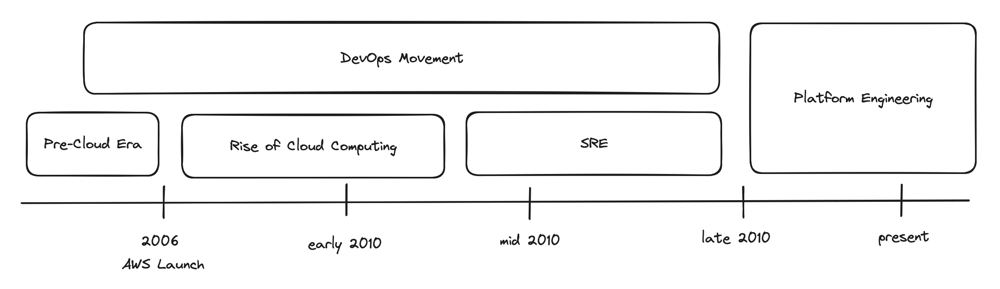

# Platform Engineering

## What is Platform Engineering?

Platform Engineering is a discipline that focuses on building and maintaining the infrastructure and tools that developers use to build and run their applications. It is a set of practices and tools that allow developers to build, test, and deploy their applications in a consistent and reliable way.

## The History of Platform Engineering

Platform Engineering has its roots in the early days of software development. In the early days, developers had to build and maintain their own infrastructure, which was time-consuming and error-prone. As software development became more complex, the need for a dedicated team to manage infrastructure and tools became apparent. Let's take a look at the history of Platform Engineering.

### Pre-Cloud Era (before 2006)

Before cloud computing became mainstream, organizations typically managed their own physical servers. The focus was on system administration, network management, and hardware maintenance. Operations teams were responsible for keeping systems running, while development teams focused on building software. The processes were often siloed, leading to inefficiencies and slower time to market.

### Rise of Cloud Computing (late 2000s)

The advent of cloud computing marked a significant shift. Services like Amazon Web Services (AWS), launched in 2006, allowed organizations to rent computing resources on-demand, reducing the need for physical hardware management. This shift led to the need for new skills and practices to manage cloud-based resources effectively.

### DevOps Movement (late 2000s - mid 2010s)

As the gap between development and operations teams became more apparent, the DevOps movement emerged to address these challenges. DevOps practices aimed to increase collaboration between development and operations, automate software delivery processes, and improve the reliability and stability of applications. Tools and practices for continuous integration (CI) and continuous delivery (CD) became central to DevOps.

### Site Reliability Engineering (SRE) (mid 2010s)

Google's introduction of Site Reliability Engineering (SRE) as a discipline brought a new perspective to managing large-scale systems. SRE focuses on creating scalable and reliable software systems, emphasizing automation, monitoring, and the importance of designing systems that gracefully handle failures.

### Platform Engineering (late 2010s - present)

Platform Engineering evolved as organizations recognized the need for a dedicated team to build and maintain internal development platforms. These platforms aim to abstract away the complexities of underlying infrastructure and tooling, enabling development teams to focus on building features and products. Platform Engineering incorporates principles from DevOps and SRE, focusing on creating self-service tools, improving developer experience, and optimizing infrastructure for scalability and reliability.

Today, Platform Engineering is recognized as a critical function within many organizations, especially those adopting microservices architectures and cloud-native technologies. The role of platform engineers continues to evolve with the advent of new technologies such as Kubernetes, serverless computing, and infrastructure as code (IaC). The focus is on building robust platforms that enable faster innovation, improve efficiency, and maintain high levels of security and compliance.

Platform Engineering is a dynamic field that continues to grow in importance as organizations strive for more efficient, scalable, and reliable software delivery practices. Its history reflects the broader evolution of software development and operations practices in response to technological advancements and changing business needs.

## References

- https://www.splunk.com/en_us/blog/learn/sre-vs-devops-vs-platform-engineering.html
- https://thenewstack.io/platform-engineering/sre-vs-devops-vs-platform-engineering/
- https://www.xenonstack.com/insights/platform-engineering-vs-devops-vs-sre
- https://humanitec.com/blog/sre-vs-devops-vs-platform-engineering
- [What is platform engineering? A quick introduction](https://circleci.com/blog/what-is-platform-engineering/)