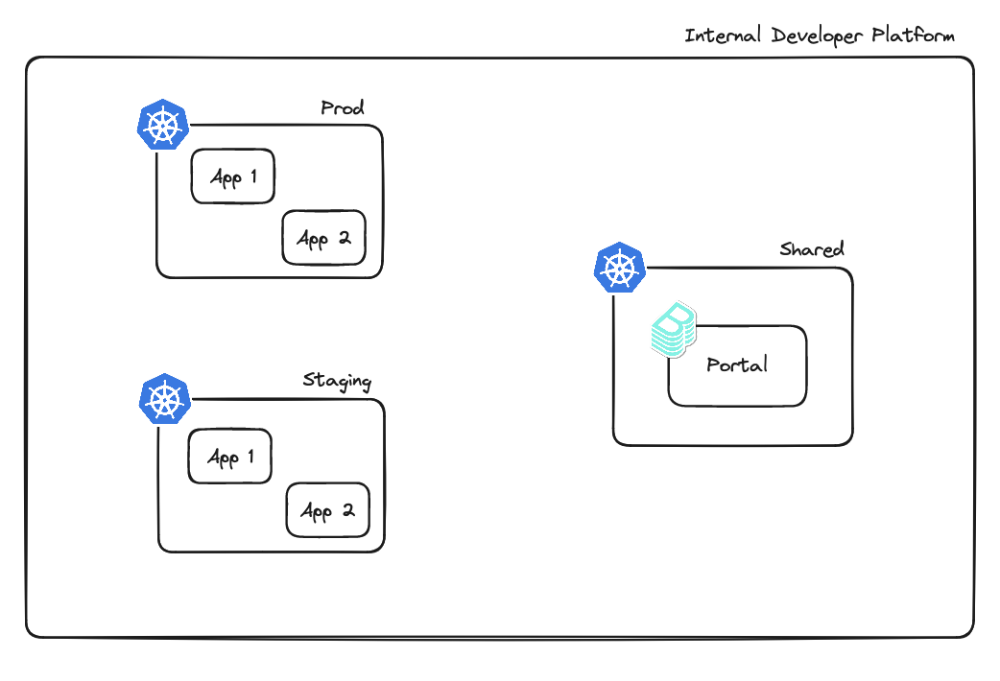

# Platform vs Portal

The terms "Internal Developer Platform" (IDP) and "Internal Developer Portal" are often used in the context of software development infrastructure, but they serve different, albeit complementary, functions within an organization. Here’s a breakdown of the key differences between a platform and a portal:

## Internal Developer Platform (IDP)

### Purpose

- An IDP is a comprehensive set of tools and technologies that streamline the software development lifecycle (SDLC), from coding and building to deployment and monitoring.
- It automates and integrates various processes within the SDLC to improve efficiency, standardize development workflows, and facilitate DevOps practices.

### Key Components

- Continuous Integration and Continuous Deployment (CI/CD) pipelines
- Infrastructure as Code (IaC) for environment provisioning
- Monitoring, logging, and alerting systems
- Security and compliance tooling
- Collaboration and version control integrations

### Benefits

- Increases developer productivity by automating repetitive tasks
- Enhances collaboration across development, operations, and security teams
- Improves application quality and deployment reliability
- Speeds up the time to market for new features and applications

### Usage

Used by developers, operations teams, and security professionals to manage the end-to-end development and deployment process.

## Internal Developer Portal

### Purpose

- An Internal Developer Portal acts as a centralized hub for developers to access information, tools, and resources needed for their work.
- It primarily focuses on improving the developer experience by making it easier to find and use internal and external APIs, documentation, and development tools.

### Key Components

- Comprehensive documentation for APIs, tools, and best practices
- API catalogs with detailed information on how to use them
- Access to development, testing, and production environments
- Collaboration tools for knowledge sharing and support
- Integration with SCM (Source Control Management) systems like Git

### Benefits

- Streamlines access to essential development resources and information
- Facilitates knowledge sharing and collaboration within and across teams
- Promotes standardization and best practices in software development
- Accelerates onboarding of new developers

### Usage

Primarily targeted at software developers who need quick and easy access to APIs, tools, documentation, and support.

## Summary of Differences

| Aspect | Internal Developer Platform | Internal Developer Portal |
| ------ | --------------------------- | ------------------------- |
| Purpose | Streamline the SDLC and DevOps practices | Improve the developer experience and access to resources |
| Key Components | CI/CD, IaC, monitoring, security, collaboration | Documentation, API catalogs, environments, collaboration |
| Benefits | Increased productivity, collaboration, reliability | Streamlined access, knowledge sharing, standardization |
| Usage | Developers, operations, security teams | Software developers |

In essence, while an Internal Developer Platform is about streamlining and automating the technical aspects of development workflows, an Internal Developer Portal focuses on providing easy access to the resources developers need to do their jobs effectively. Organizations often implement both to maximize productivity, collaboration, and innovation in software development.